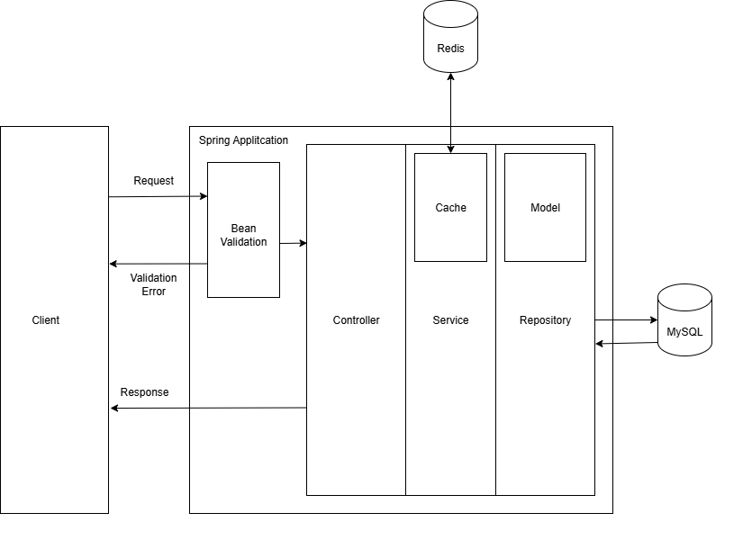

# 🧱 Arquitetura da Aplicação

A API REST foi construída com base em uma **arquitetura em camadas**. Essa abordagem facilita a manutenção, testes e evolução do código ao separar claramente as responsabilidades de cada parte do sistema.

---

## 🔁 Camadas Principais

### 1. **Controller**
Responsável por expor os endpoints HTTP. Cada controller recebe requisições, delega o processamento para a camada de serviço e retorna as respostas apropriadas.

- Exemplo: `PacienteController`, `ConsultaController`
- Anotações comuns: `@RestController`, `@RequestMapping`, `@GetMapping`, etc.

---

### 2. **Service**
Contém a lógica de negócio. Realiza validações, regras e orquestra o fluxo entre as entidades, DTOs e repositórios.

- Exemplo: `PacienteService`, `ConsultaService`
- Anotação comum: `@Service`

---

### 3. **Repository**
Responsável por interagir com o banco de dados. Utiliza Spring Data JPA para consultas e persistência de dados.

- Exemplo: `PacienteRepository`, `ConsultaRepository`
- Anotação comum: `@Repository`

---

### 4. **DTOs e Mappers**
Evita o acoplamento direto entre as entidades e as requisições/respostas da API. Os DTOs transportam dados entre camadas. Os mappers (geralmente com MapStruct) fazem a conversão entre entidades e DTOs.

- Exemplo: `PacienteDTO`, `ConsultaMapper`

---

### 5. **Entidades (Domain)**
Representam o modelo de dados da aplicação. São anotadas com JPA para persistência no banco de dados.

- Exemplo: `Paciente`, `Consulta`, `Medico`
- Anotações comuns: `@Entity`, `@Table`, `@Id`, etc.

---

## 🔄 Fluxo Resumido de uma Requisição



---

## Organização de Pacotes
```text
	clinic-api/
	└── src/
    	└── main/
        	└── java/
            	└── com/
                └── example/
                    └── clinic-api/
                        ├── controller/
                        ├── service/
                        ├── repository/
                        ├── domain/
                        ├── dto/
                        └── mapper/

```

---

## 🔍 Observações
- A arquitetura é simples, porém bem estruturada, facilitando refatorações futuras.
- Pode evoluir para Hexagonal Architecture ou DDD caso o projeto cresça.
